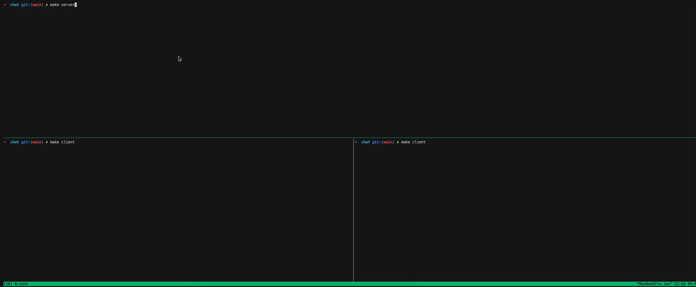

# Chat
This repo presents a 1 to 1 chat application implemented with a custom [protocol](#protocol) on top of TCP has been implemeneted. 



# Quick start

### Install the dependencies
```bash
$ opam switch create .

$ opam install .

$ eval $(opam env --set-switch)
```

### Start the application

```bash
# Run server
$ make server

# Run on specific port
$ dune exec chat server 9090

# Run client
$ make client

# Connect to specific host
$ dune exec chat client 192.168.31.111:9090
```

# Protocol Message Format

The protocol follows a text framing format consisting of a header separated by a line feed (`\n`), followed by the body. Text was choosen to reduce complexities of byte ordering and machine architecture.

## Example Message format
```text
13 MSG 1\nHello, OCaml!
```

# Layout
```
.
├── Makefile
├── bin
│   ├── cmd.ml              # Command line app
│   └── main.ml
├── lib
│   ├── client.ml           # Client chat application implementation
│   ├── client.mli 
│   ├── errors.ml           # Lib related errors
│   ├── handler.ml          # Chat handlers utilized by client and server
│   ├── infix.ml            # Ocaml helper infixes
│   ├── protocol.ml         # Defines the protocol, marshaling, and read/write methods.
│   ├── roundtrip.ml        # Data structure that tracks round trip
│   ├── roundtrip.mli 
│   ├── server.ml           # Server chat application implementation
│   └── server.mli  
└── test
    └── protocol_test.ml    # Tests on protocol
```

## Message Protocol Format
The message consists of three components:

| Component | Description |
|-----------|-------------|
| `Header`  | Contains size, method. |
| `LF (\n)` | A line feed character separating the header from the body. |
| `Body`    | The actual message content. |

## Header Format
The header consists of three fields:

| Field           | Type   | Description |
|----------------|--------|-------------|
| `size`         | `int32` | The size of the body. This does not include the header. Used for reading the next `size` bytes in the tcp stream  |
| `method` | `string` | The method indicating the type of message. |
| `id`           | `int32` | A unique identifier for the message. Used for acknowledgments. |

### Methods
The `request_method` field specifies the type of request being made. It follows a convention inspired by HTTP methods.

| Method   | Description |
|----------|-------------|
| `ACK id` | Acknowledges a message with the given ID. |
| `MSG id` | Represents a message with an assigned ID. |
| `UNAVAIL` | Indicates that the receiver cannot handle the connection. |

### Message Identification
The `id` field uniquely identifies a message and is used for acknowledgment purposes. 


## Unmarshaling the message Protocol
1. Read the first line (first encountered lf) from TCP stream and parse the header.
2. Parse the header and extract the `size`.
3. Read the next `size` bytes from TCP stream to attain the body.

# Testing
The project includes minor testing mainly on the marshaling and unmarshaling of text stream to the Protocol.

```
$ dune runtest
```